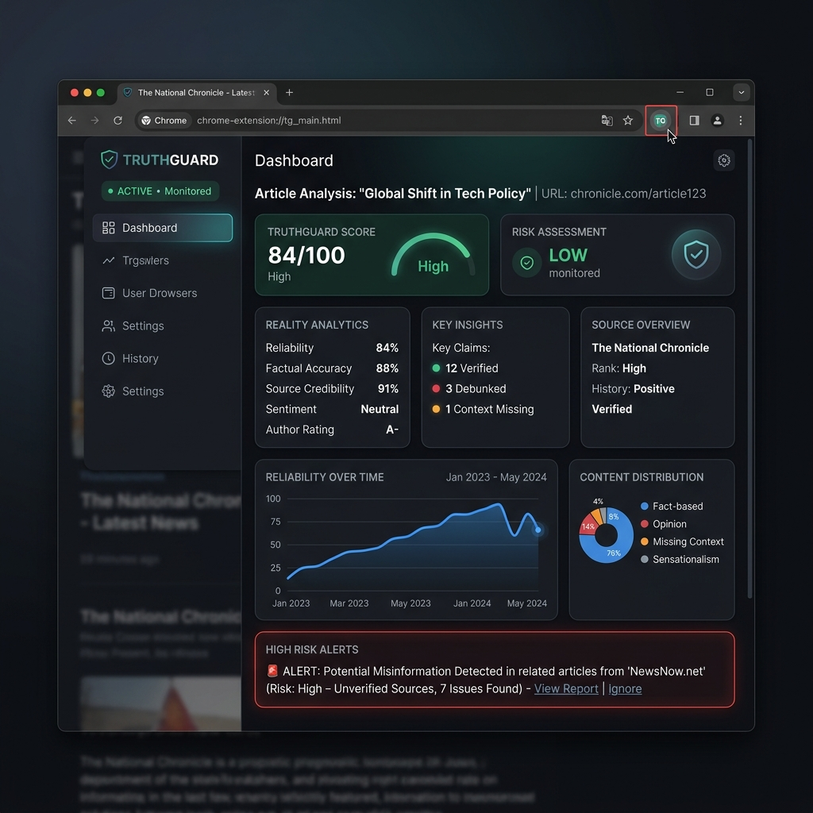
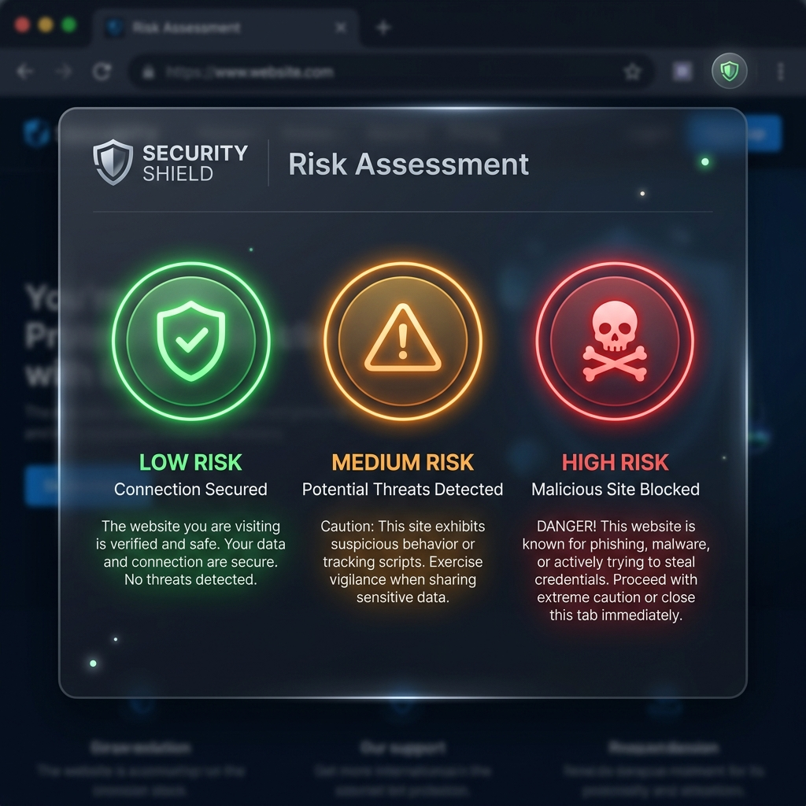

# 🛡️ TruthGuard - Premium Fake News & Website Detector Extension

[](https://vijaymahes9080.github.io/fake-detector-on-news-and-website_entension/)
[](https://developer.chrome.com/docs/extensions/mv3/intro/)
[](LICENSE)

TruthGuard is a lightweight and premium Google Chrome Extension designed to detect misleading articles, sensationalist clickbait, biased publications, and deceptive phishing websites in real time. It analyzes standard page context, flags potential warning indicators, and details threat risk rankings with real‑world impact gauges.

---

## 📸 Interface Previews

### 1. Interactive Blocker Sandbox & Web Simulator
Test the extension's live classification responses on diverse articles (Reliable news, Tabloid opinion, Phishing domain warning) using the hosted simulation workspace:



### 2. Multi-Level Risk Status Indicators
Exposes trust alerts via intuitive colored indicators to warn readers about misinformation before they scroll:



---

## ⚡ Key Features

- 🔍 **Real‑Time Page Scanning**: Runs instantly in the background when you navigate to articles, assessing text characteristics and verification sources.
- 🚦 **Intuitive Risk Grading**:
  - 🟢 **Low Risk (Green)**: Verified credibility, unbiased structures (e.g. `bbc.com`, `reuters.com`).
  - 🟡 **Medium Risk (Orange)**: Extreme bias, sensationalised tabloids, clickbait titles.
  - 🔴 **High Risk (Red)**: Fake domains, malicious phishing scams, fully fabricated claims.
- 📊 **Real‑World Impact Metrics**: Dynamically calculates a simulated impact percentage to help users understand the scale of potential misinformation.
- 💎 **Premium Glassmorphic UI**: Sleek browser action popup designed with Google Inter/Outfit fonts, glowing backdrops, and active animated transitions.

---

## 🔧 Installation Guide (Developer Mode)

You can load this developer build directly into your Google Chrome browser using these quick steps:

1. **Download the Extension Source**:
   - Download the project as a ZIP archive: [Download ZIP](https://github.com/vijaymahes9080/fake-detector-on-news-and-website_entension/archive/refs/heads/main.zip)
   - Or clone the repository locally using Git:
     ```bash
     git clone https://github.com/vijaymahes9080/fake-detector-on-news-and-website_entension.git
     ```
2. **Extract Files**:
   - Extract the downloaded ZIP file to a convenient local folder on your computer (e.g. `C:\Projects\TruthGuard`).
3. **Open Chrome Extensions Page**:
   - In Google Chrome, go to the URL: `chrome://extensions/`
4. **Enable Developer Mode**:
   - Toggle the **Developer mode** switch in the top-right corner to **ON**.
5. **Load Unpacked Folder**:
   - Click the **Load unpacked** button in the top-left corner.
   - Choose the directory containing the extracted project files (the folder containing the `manifest.json` file).
6. **Start Guarding**:
   - Click the puzzle icon in Chrome's toolbar, pin **TruthGuard**, and read news distraction-free!

---

## 📁 Repository Structure

- [chrome-polyfill.js](chrome-polyfill.js): Extension API storage and message-passing fallback handler for web browser hosting.
- [manifest.json](manifest.json): Extension configuration detailing background script permissions, action popups, and asset locations.
- [content.js](content.js): Scrapes page context and runs simulated news analysis scripts in-tab.
- [popup.html](popup.html) / [popup.js](popup.js) / [popup.css](popup.css): The UI layout, script handlers, and premium stylesheet of the action popup.
- [index.html](index.html) / [index.js](index.js) / [index.css](index.css): Interactive browser simulation dashboard hosted on GitHub Pages.
- [images/](images/): Visual interface mockups and assets for documentation.
- [icons/](icons/): High-resolution asset icons displaying Low, Medium, and High risk statuses.

---

## 🚀 Live Web Sandbox
Try the extension simulator directly in your browser without any installation:
👉 **[Try the Live Web Sandbox](https://vijaymahes9080.github.io/fake-detector-on-news-and-website_entension/)**
